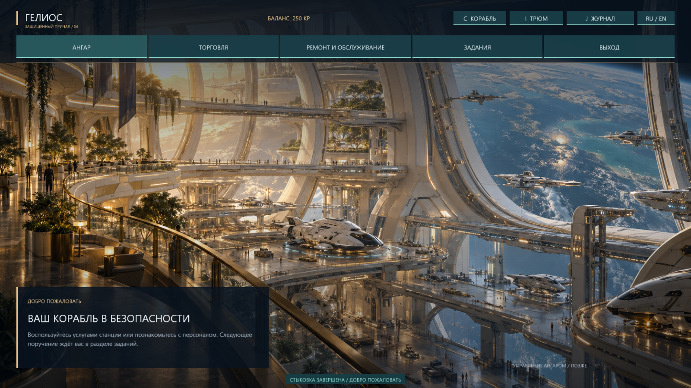
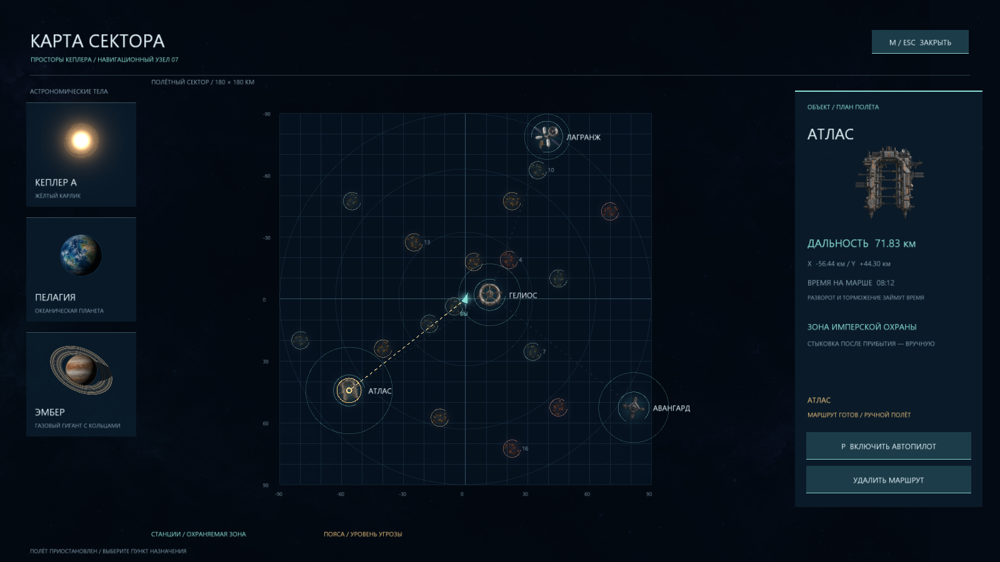
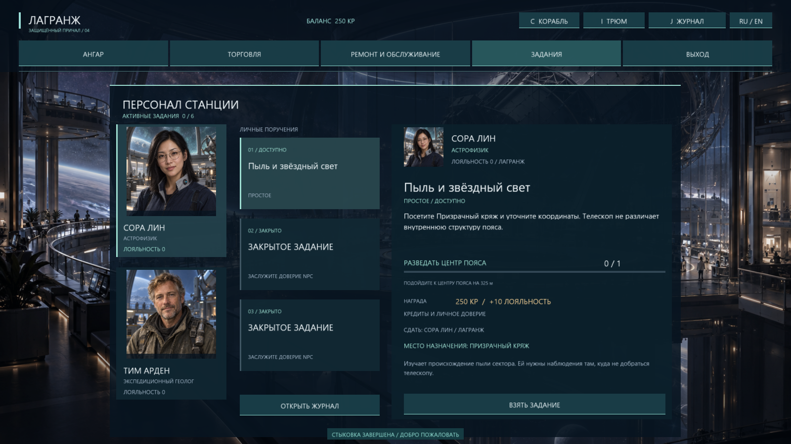

# Space2D Demo 1.2.0

Космическая 2D-демоверсия для **Windows 10/11 x64 / Direct3D 12**. Инерционный полёт, добыча минералов, бои с пиратами, станции и задания их обитателей.

**[Скачать Space2D 1.2.0 для Windows](https://github.com/mospromsoft-dotcom/Space2D-Demo/releases/download/v1.2.0/Space2D-1.2.0-win64.zip)** · [Страница выпуска](https://github.com/mospromsoft-dotcom/Space2D-Demo/releases/tag/v1.2.0) · [История изменений](CHANGELOG.md)

## Новое в 1.2.0

- Четыре разных интерьера станций с анимацией: жилой терминал, верфь, военная цитадель и обсерватория.
- Восемь NPC с портретами и биографиями, 24 задания на разведку, руду и пиратов. Лояльность открывает продолжения цепочек; награды — кредиты и оборудование.
- Журнал **J**: прогресс, история, награды и маршрут. Выполненное задание направляет обратно к выдавшему его сотруднику.
- Большая карта **M**, выбор цели и автопилот **P**. Корабль разворачивается, разгоняется и тормозит обычными двигателями.
- Более тяжёлое, инерционное движение кораблей, особенно грузовых судов, линкоров и охраны.
- Полноэкранный запуск, анимированная заставка и меню новой игры.

## Запуск

1. Скачайте ZIP по ссылке выше. Вход в GitHub не требуется.
2. Распакуйте **весь архив** в отдельную папку.
3. Запустите `Space2D.exe`, нажмите пробел на заставке и выберите «Начать новую игру».

DLL, `assets` и `shaders` должны оставаться рядом с EXE. Установка и подключение к сети для игры не нужны. F11 переключает полноэкранный и оконный режим; `Space2D.exe --windowed` сразу запускает окно.

Файлы `Source code`, автоматически показанные GitHub в выпуске, содержат страницу этого репозитория. Сама игра находится в **Space2D-1.2.0-win64.zip**. Рядом с архивом опубликован `SHA256SUMS.txt`; `BUILD_INFO.json` внутри архива указывает версию и исходный commit сборки.

## Управление

| Действие | Клавиши |
|---|---|
| Направление | Мышь |
| Тяга / тормоз / боковые двигатели | W / S / A, D |
| Стрельба / выбор объекта | ЛКМ / ПКМ |
| Боевое оружие / бур / переключение | 1 / 3 / Tab |
| Корабль / трюм / подобрать контейнер | C / I / E |
| Карта сектора / автопилот | M / P |
| Журнал заданий | J |
| Зум / маяк следующего пояса / радар | Колесо / B / V |
| Русский / English | L или кнопка RU/EN |
| Фоновый звук / весь звук / громкость | F6 / F7 / −, + |
| Пауза / полный экран / снимок | Esc / F11 / F12 |
| Демо-облёт / следующая станция / перезапуск | F2 / F3 / R |

## Первый рейс

Стартовое оснащение — обычная плазма и буровой лазер, щита пока нет. Корабль продолжает дрейфовать после выключения тяги: тормозите заранее. На карте M выберите пояс и нажмите P. Ручная тяга, тормоз или огонь отключают автопилот. Планеты и солнце доступны для осмотра, но находятся за пределами полётного сектора.

Астероиды разрушаются только буром: подлетите примерно на 160 м от излучателя и удерживайте огонь. Контейнеры подбираются клавишей E с расстояния до 90 м. В поясах встречаются пираты разных рангов.

Выберите станцию ПКМ и подлетите прямо над ней, чтобы появилась стыковка. Верхнее меню станции: **Ангар / Торговля / Ремонт и обслуживание / Задания / Выход**. «Выход» отстыковывает. В торговле можно продать руду; оснащение корабля открывается из обслуживания. Установить или снять модули можно только на станции.

В разделе заданий выберите NPC и поручение. Одновременно доступны шесть активных заданий. В журнале J можно проложить маршрут и включить автопилот; при выполнении цель меняется на станцию сдачи, автопилот нужно включить снова. Руда списывается при сдаче. Если для награды не хватает места, освободите трюм: до этого сдача ничего не расходует. Лояльность каждого NPC повышается отдельно.

## О демоверсии

В секторе четыре станции, две планеты, 16 минеральных поясов, нейтральные корабли, имперская охрана и пираты. Есть торговля, ремонт, модульное оснащение и пять грейдов оборудования. Русский и английский интерфейс, тихий фон и радиопереговоры; настройки языка и звука сохраняются.

Это автономный прототип: **игровой прогресс между запусками не сохраняется**. Новая игра и R также сбрасывают прогресс. Сетевой игры пока нет. Проверено на Windows 10 / NVIDIA GTX 970; совместимость с другими конфигурациями может отличаться.

Репозиторий предназначен для публикации готовых демосборок. Исходный код движка и игры здесь не размещается. Происхождение сторонних компонентов — [THIRD_PARTY.md](THIRD_PARTY.md); необходимые тексты лицензий включены в ZIP.
