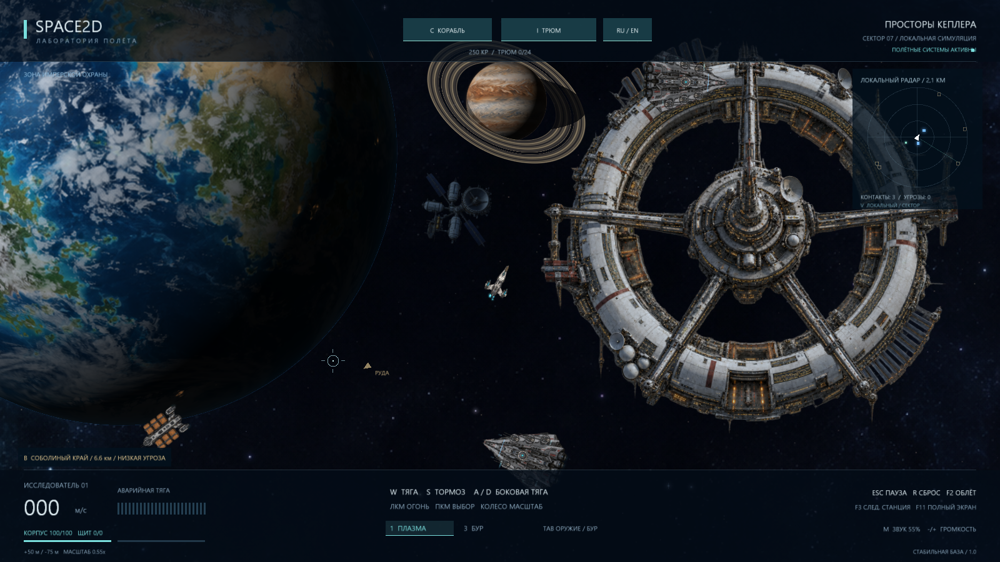

# Space2D Demo

Космическая 2D-демоверсия для **Windows 10/11 x64 / Direct3D 12**. Полёт, добыча минералов, бои с пиратами, стыковка, торговля и модульное оснащение корабля.

**[Скачать Space2D 1.0.0 для Windows](https://github.com/mospromsoft-dotcom/Space2D-Demo/releases/download/v1.0.0/Space2D-1.0.0-win64.zip)** · [Страница выпуска](https://github.com/mospromsoft-dotcom/Space2D-Demo/releases/tag/v1.0.0)

## Запуск

1. Скачайте ZIP по ссылке выше. Вход в GitHub не требуется.
2. Распакуйте **весь архив** в отдельную папку.
3. Запустите `Space2D.exe` из распакованной папки.

DLL, `assets` и `shaders` должны оставаться рядом с EXE. Установка и подключение к сети для игры не нужны. Файлы `Source code`, автоматически показанные GitHub в выпуске, содержат страницу этого репозитория; сама игра находится в `Space2D-1.0.0-win64.zip`.

## Управление

| Действие | Клавиши |
|---|---|
| Направление | Мышь |
| Тяга / тормоз / боковые двигатели | W / S / A, D |
| Стрельба / выбор объекта | ЛКМ / ПКМ |
| Боевое оружие / бур / переключение | 1 / 3 / Tab |
| Корабль / трюм / подобрать контейнер | C / I / E |
| Зум / маяк следующего пояса / радар | Колесо / B / V |
| Русский / English | L или кнопка RU/EN |
| Фоновый звук / весь звук / громкость | F6 / M / −, + |
| Пауза / полный экран / снимок | Esc / F11 / F12 |
| Демо-облёт / следующая станция / перезапуск | F2 / F3 / R |

Стартовое оснащение — плазма и буровой лазер. Астероиды разрушаются только буром: подлетите примерно на 160 м от излучателя и удерживайте огонь. Контейнеры подбираются клавишей E с расстояния до 90 м. Выберите станцию ПКМ и подлетите прямо над ней, чтобы появилась стыковка. Оборудование меняется на станции.

## О демоверсии

В секторе четыре станции, две планеты, минеральные пояса, нейтральные корабли, имперская охрана и пираты. Есть русский и английский интерфейс, тихий фон и радиопереговоры. Настройки языка и звука сохраняются.

Это автономный прототип: **игровой прогресс между запусками не сохраняется**, сетевой игры пока нет. Проверено на Windows 10 / NVIDIA GTX 970; совместимость с другими конфигурациями может отличаться.

Репозиторий предназначен для публикации готовых демосборок. Исходный код движка и игры здесь не размещается. Происхождение сторонних компонентов — [THIRD_PARTY.md](THIRD_PARTY.md); необходимые тексты лицензий включены в ZIP.
